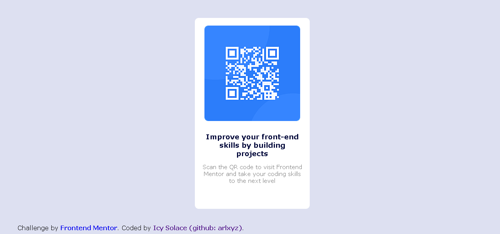

# Frontend Mentor - QR code component solution

This is a solution to the [QR code component challenge on Frontend Mentor](https://www.frontendmentor.io/challenges/qr-code-component-iux_sIO_H). Frontend Mentor challenges help you improve your coding skills by building realistic projects. 

## Table of contents

- [Overview](#overview)
  - [Screenshot](#screenshot)
  - [Links](#links)
- [My process](#my-process)
  - [Built with](#built-with)
  - [What I learned](#what-i-learned)
  - [Useful resources](#useful-resources)
- [Author](#author)
- [Acknowledgments](#acknowledgments)

**Note: Delete this note and update the table of contents based on what sections you keep.**

## Overview

### Screenshot

### Links

- Live Site URL: [Visit Site](https://qrcode-arlxyz.com)

## My process

### Built with

- Semantic HTML5 markup
- CSS Display, Flexbox, Positioning

### What I learned

I learned how to host in github, also to know where to practice front end development much more with hands on. @Frontendmentor.io

### Useful resources

- [GitHub](https://pages.github.com) - This helped me to host this website since it is my first time
- [CSS in W3 Schools](https://www.w3schools.com/css/default.asp) - helped me in recalling some of the properties

## Author

- LinkedIn - (https://www.linkedin.com/in/arlene-obinguar-796165218/)
- Github - (https://github.com/arlxyz)
- Frontend Mentor - [@yourusername](https://www.frontendmentor.io/profile/yourusername)
- Twitter - [@yourusername](https://www.twitter.com/yourusername)

## Acknowledgments

Thank you for W3Schools, Frontendmentor.io and Github, for giving a wonderful resources for people who wants to dive in to web development, Without these websites, I will be stucked in just creating websites by my own without learning how to host it or even searching while finding it out the problems with my own.

